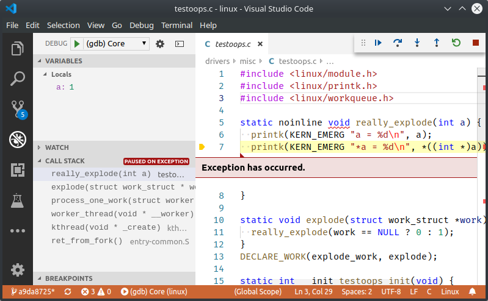

# oops2core: convert Linux crash report to a core file

With this tool you can debug kernel Oopses with gdb or graphical IDE's such as
vscode without enabling any extra debugging features in kernel configuration,
just by using the Oops output from the Linux kernel logs or console.

This may be useful when debugging sporadically appearing errors with the kernel
when there are no extra details, but you have access to the vmlinux (ELF) file.

You can debug Oopses with use of gdb or graphical IDEs such as vscode, with
ability to inspect local variables (as long as they are on stack or in the
registers at the moment of crash).

Note that this doesn't replace kdumps (vmcore), it just generates small core
files containing the register values and the stack to make debugging of Oopses
easier than working with disassembly and analysis of stack contents by hand.
Kdumps generate a complete core dump which can be used the same way, but getting
kdumps is much more complicated and is not always possible.

## Limitations

Currently only crashes reported on 32-bit ARM platforms are supported. If there
will be interest I may be adding support for other architectures.

This software likely requires more testing on various Linux kernel versions and
using various different log formats. If you find trouble using it please report
a GitHub issue.

## Install

```shell
go get opensource.go.fig.lu/oops2core
```

For debugging cross-compiled kernel you may also need to:

```shell
apt-get install gdb-multiarch
```

## Usage: generating core

You can run oops2core and just copy&paste Oops to it's standard input. Core
will be generated on standard output if there are no errors.

```shell
cat oops.txt | $(go env GOPATH)/bin/oops2core > core
```

## Debugging with gdb

```shell
gdb-multiarch vmlinux -c core
```
 
## Debugging with vscode

Follow those simple steps with vscode started in the Linux kernel
tree:

1. Edit launch configurations with `Debug` -> `Add Configuration...`
2. Start with C/C++ gdb launch template
3. Set `"program"` to vmlinux path
4. Set `"coreDumpPath"` to core path
5. Set `"miDebuggerPath"` to `gdb-multiarch`
6. Run the configuration, you should be able to browse the call
   stack and inspect some local variables.

## Example

This is an example basing on simple module I made for testing:

Following crash report:

```
[    2.447610] testoops loaded
[    2.449445] a = 1
[    2.451363] Unable to handle kernel NULL pointer dereference at virtual address 00000001
[    2.454438] pgd = (ptrval)
[    2.455915] [00000001] *pgd=00000000
[    2.457671] Internal error: Oops: 5 [#1] PREEMPT ARM
[    2.459314] Modules linked in:
[    2.460932] CPU: 0 PID: 17 Comm: kworker/0:2 Not tainted 4.18.20-yocto-standard+ #3
[    2.463728] Hardware name: ARM-Versatile (Device Tree Support)
[    2.465477] Workqueue: events explode
[    2.466969] PC is at really_explode+0x24/0x3c
[    2.468350] LR is at wake_up_klogd+0x58/0x8c
[    2.472742] pc : [<c052fa4c>]    lr : [<c006d464>]    psr: 60000113
[    2.474303] sp : cf9cfef0  ip : cf9cfe38  fp : cf9cff04
[    2.476136] r10: c0bc7d74  r9 : 00000000  r8 : 00000000
[    2.477646] r7 : cfdaa200  r6 : c0b43050  r5 : c0ba6f24  r4 : 00000001
[    2.479216] r3 : c7d5b9c6  r2 : c7d5b9c6  r1 : 00000000  r0 : 00000005
[    2.480871] Flags: nZCv  IRQs on  FIQs on  Mode SVC_32  ISA ARM  Segment none
[    2.482523] Control: 00093177  Table: 00004000  DAC: 00000053
[    2.484159] Process kworker/0:2 (pid: 17, stack limit = 0x(ptrval))
[    2.485854] Stack: (0xcf9cfef0 to 0xcf9d0000)
[    2.487561] fee0:                                     cf9c3120 c0ba6f24 cf9cff14 cf9cff08
[    2.490814] ff00: c052fa84 c052fa34 cf9cff4c cf9cff18 c0045338 c052fa70 c0b4bae0 ffffe000
[    2.495144] ff20: c0b43064 cf9c3120 cf9c3134 c0b43050 c0b4bae0 c0b43050 c0b43064 00000008
[    2.498513] ff40: cf9cff7c cf9cff50 c004610c c00450b4 cf915be0 cf97ff40 cf9c9020 cf9ce000
[    2.501931] ff60: cf9c3120 c0045df0 cf9cde90 cf97ff58 cf9cffac cf9cff80 c004b1d8 c0045dfc
[    2.515526] ff80: cf9ce000 cf9c9020 c004b0ac 00000000 00000000 00000000 00000000 00000000
[    2.519240] ffa0: 00000000 cf9cffb0 c00090e0 c004b0b8 00000000 00000000 00000000 00000000
[    2.522947] ffc0: 00000000 00000000 00000000 00000000 00000000 00000000 00000000 00000000
[    2.526655] ffe0: 00000000 00000000 00000000 00000000 00000013 00000000 00000000 00000000
[    2.530815] [<c052fa4c>] (really_explode) from [<c052fa84>] (explode+0x20/0x24)
[    2.534683] [<c052fa84>] (explode) from [<c0045338>] (process_one_work+0x290/0x44c)
[    2.538505] [<c0045338>] (process_one_work) from [<c004610c>] (worker_thread+0x31c/0x4c8)
[    2.542607] [<c004610c>] (worker_thread) from [<c004b1d8>] (kthread+0x12c/0x144)
[    2.546736] [<c004b1d8>] (kthread) from [<c00090e0>] (ret_from_fork+0x14/0x34)
[    2.550735] Exception stack(0xcf9cffb0 to 0xcf9cfff8)
[    2.552884] ffa0:                                     00000000 00000000 00000000 00000000
[    2.557139] ffc0: 00000000 00000000 00000000 00000000 00000000 00000000 00000000 00000000
[    2.561364] ffe0: 00000000 00000000 00000000 00000000 00000013 00000000
[    2.563689] Code: e1a04000 e1a01000 e59f0010 ebecf88e (e5941000) 
[    2.567009] sym53c8xx 0000:00:0d.0: enabling device (0100 -> 0103)
[    2.571145] sym0: <895a> rev 0x0 at pci 0000:00:0d.0 irq 67
[    2.577724] sym0: No NVRAM, ID 7, Fast-40, LVD, parity checking
[    2.587651] sym0: SCSI BUS has been reset.
[    2.589926] scsi host0: sym-2.2.3
[    2.598784] ---[ end trace 327c9ddee2e33b2e ]---
```

By copy & pasting to oops2core above oops can be debugged with vscode as shown below:



Or with gdb:

```
$ gdb-multiarch vmlinux -c core
GNU gdb (Ubuntu 8.1-0ubuntu3) 8.1.0.20180409-git
Copyright (C) 2018 Free Software Foundation, Inc.
License GPLv3+: GNU GPL version 3 or later <http://gnu.org/licenses/gpl.html>
This is free software: you are free to change and redistribute it.
There is NO WARRANTY, to the extent permitted by law.  Type "show copying"
and "show warranty" for details.
This GDB was configured as "x86_64-linux-gnu".
Type "show configuration" for configuration details.
For bug reporting instructions, please see:
<http://www.gnu.org/software/gdb/bugs/>.
Find the GDB manual and other documentation resources online at:
<http://www.gnu.org/software/gdb/documentation/>.
For help, type "help".
Type "apropos word" to search for commands related to "word"...
Reading symbols from vmlinux...done.
[New process 1]
Program terminated with signal SIGSEGV, Segmentation fault.
#0  really_explode (a=1) at drivers/misc/testoops.c:7
7         printk(KERN_EMERG "*a = %d\n", *((int *)a));
(gdb) bt
#0  really_explode (a=1) at drivers/misc/testoops.c:7
#1  0xc052fa84 in explode (work=<optimized out>) at drivers/misc/testoops.c:11
#2  0xc0045338 in process_one_work (worker=0xcf9c3120, work=0xc0ba6f24 <explode_work>) at kernel/workqueue.c:2153
#3  0xc004610c in worker_thread (__worker=0xcf9c3120) at kernel/workqueue.c:2296
#4  0xc004b1d8 in kthread (_create=0xcf9c9020) at kernel/kthread.c:246
#5  0xc00090e0 in ret_from_fork () at arch/arm/kernel/entry-common.S:158
Backtrace stopped: previous frame identical to this frame (corrupt stack?)
(gdb) up
#1  0xc052fa84 in explode (work=<optimized out>) at drivers/misc/testoops.c:11
11        really_explode(work == NULL ? 0 : 1);
(gdb) 
#2  0xc0045338 in process_one_work (worker=0xcf9c3120, work=0xc0ba6f24 <explode_work>) at kernel/workqueue.c:2153
2153            worker->current_func(work);
(gdb) 
#3  0xc004610c in worker_thread (__worker=0xcf9c3120) at kernel/workqueue.c:2296
2296                            process_one_work(worker, work);
(gdb) l
2291
2292                    pool->watchdog_ts = jiffies;
2293
2294                    if (likely(!(*work_data_bits(work) & WORK_STRUCT_LINKED))) {
2295                            /* optimization path, not strictly necessary */
2296                            process_one_work(worker, work);
2297                            if (unlikely(!list_empty(&worker->scheduled)))
2298                                    process_scheduled_works(worker);
2299                    } else {
2300                            move_linked_works(work, &worker->scheduled, NULL);
(gdb) 
```

## References

1. ELF ABI: http://www.sco.com/developers/gabi/latest/contents.html
2. Linux documentation on debugging Oopses: https://www.kernel.org/doc/html/latest/admin-guide/bug-hunting.html
3. Linux kernel core dump implementation: https://elixir.bootlin.com/linux/v5.1.15/source/fs/binfmt_elf.c#L2202
4. Kernel dump documentation: https://www.kernel.org/doc/Documentation/kdump/kdump.txt

## License

This software is licensed under MIT license. See "LICENSE" file for details.

